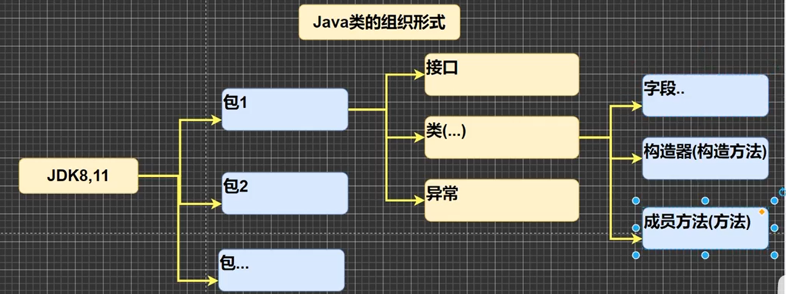

## JAVA特点
* 面向对象，解释性(`javascript,PHP`——编译-解释-机器执行)

## JAVA开发工具
* `editplus, notepad++, Sublime Text(前期算法), IDEA, eclipse`

## JDK是什么
* `.java`是程序,编译(`javac`)成`.class`,操作系统安装JVM(JAVA虚拟机)来运行(`java`),JDK中则包含JVM
* JDK-Java Development Kit = JRE+Java的开发工具(java,javac,javadoc...)
* JRE-Java Runtime Environment = JVM+JavaSE标准类库

## 快速入门
````java
public class hello{
    public static void main(String[] args){
        System.out.println("Hello world");
    }
}
class Dog{

}
class tiger{

}
//编译后每一个类都对应一个class文件
````
### 注意事项
* java源文件以`.java`为扩展名，其基本组成部分是类(`class`),最多只有一个`public`类, 文件名必须是`public`类名(如果该文件里有`public`类)； 执行程序入口是`main`,具有固定格式`public static void main(String[] args)`,可将`main`方法写在非`public`类中,然后指定运行非`public`类。
* 每一个语句`;`必不可少

### 转义字符
````java
\n 换行
\t 制表
\\斜杠
\" "
\' 
\r 回车 //表示光标从最后放置最前
````

### 注释
* 单行注释 `//`
* 多行注释 `/*注释文字*/`,静止套娃
* 文档注释 注释的内容可以被`javadoc`工具解析，生成一套以网页文件形式体现的该程序的说明文档，一般写在类、方法上面。标签有关键字
````java
/**
  *@author
  *@version
 */
 class Dog{
     ······
 }
````

### 代码规范
《阿里巴巴Java开发手册》
* 对于类,方法的注释需要用`javadoc`方式书写
* 使用`tab/ctrl+]`向右缩进，使用`shift+tab/ctrl+[`向左移动
* 运算符两边各加空格
* 源文件使用utf-8编码
* 行宽不超过80字符
* 次行风格和行尾风格(推荐)

### DOS相关
* 相对路径 `..\`到上一级目录
* DOS命令: `cd ..` 切到上一级；`cd \` 切到根目录；  `tree`查看指定目录下的所有子级目录；`cls`清屏;`exit`退出DOS;`md`创建目录；`rd`删除目录；`copy`复制文件；`del`删除文件；`echo`输入内容到文件；`type`创建空文件；`move`移动文件。

### API文档的使用
* Application Programming Interface
* 中文在线文档<https://www.matools.com/api>
* Java类的组织形式
  
  
* 包-类-方法

### 键盘输入语句
* 使用Scanner类
    ````java
  import java.util.Scanner;//表示导入java.util包下的Scanner类
    public class Input{
        //编写一个main方法
        public static void main(String[] args){
            //接收用户的输入
            //步骤
            //1. 引入Scanner类，表示简单的文本扫描器
            //2. 创建一个Scanner类的对象实例
            Scanner myScanner = new Scanner(System.in);
            //3. 使用相关方法接收用户的输入
            System.out.println("请输入名字");
            String name = myScanner.next();//接收用户输入
            System.out.println("请输入年龄");
            int age = myScanner.nextInt();//接收用户输入
            System.out.println("请输入薪水");
            double sal = myScanner.nextDouble();//接收用户输入
            System.out.println(""+name+age+sal);

        }
    }
    ````

 


