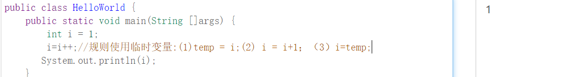
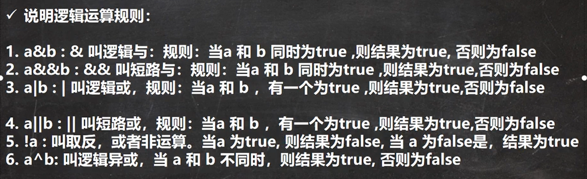
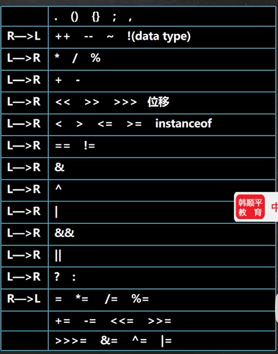
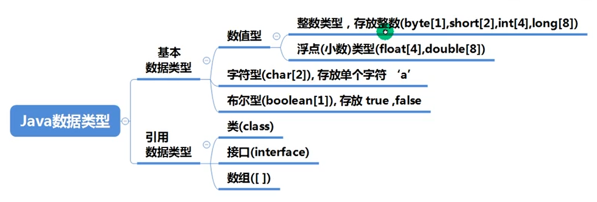
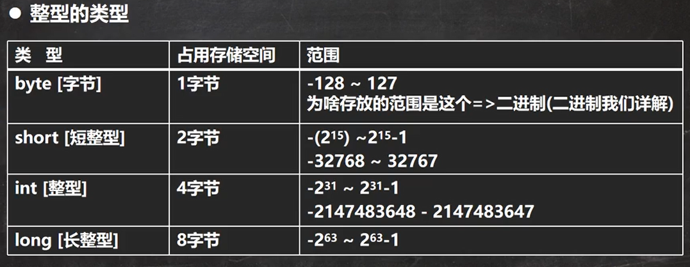
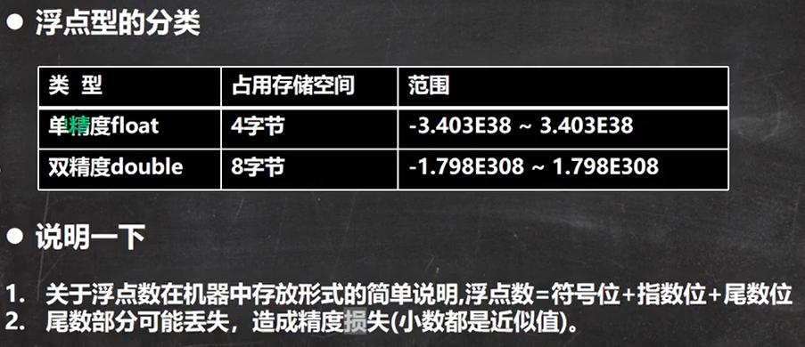

# 变量

## 介绍
* 变量是程序的基本组成单位，有三个基本要素`类型+名称+值`
* 变量相当于内存中一个数据存储空间的表示，变量名表示地址，变量值表示该地址上的值。
* 变量在同一个作用域不能重名

## 标识符
* `26字母`,`0-9`,`_`,`$`组成
**命名规范**
* 包名:所有的字母小写,使用`.`,`aaa.bbb.ccc`
* 类名/接口名:单词首字母大写,`XxxYyyZzz`[大驼峰]
* 变量/方法名:第一个单词首字母小写，第二个单词开始每个单词首字母大写,`xxxYyyZzz`[小驼峰/驼峰]
* 常量名:所有字母都大写，使用`_`连接,`XXX_YYY_ZZZ`
* 尽量用英文


## 运算符
### +号的使用
* 从左向右运算
* 两方为数值,加法运算
* 有一方为字符串，拼接运算
### 运算
* `int/int = int`
* 取余，套公式:`a%b = a-a/b*b`,运算的结果和被除数的符号一致
* `++a`先自增后赋值,`a++`先赋值后自增

  

* `&&`如果第一个条件为false，则第二个条件不会运行(效率高),`&`则都会判断(不推荐使用)
* `||`如果第一个条件为true,则第二个条件不会运行(效率高),`|`则都会判断(不推荐使用)
* `a^b`逻辑异或,当`a`和`b`两边的条件结果不同时，则结果为`true`，否则为`false`.
* 三元运算符`条件express?express1:express2`,`express1&2`需要是可以赋给接收变量的类型（或可自动转换)



## 数据类型
  

* String 属于类
  

* `bit`计算机中最小的存储单位；`byte`计算机中基本存储单位;`1 byte = 8 bit`
  
  
* 默认(推荐用)double类型,`float a = 1.1f`;`double a = 1.1f`小空间赋给大空间可
* `0.123 = .123`
* 科学计数法 `5.12e2 = 5.12*10^2 = 512.0`、`5.12E-2 = 5.12/10^2 = 0.0512`
**注意事项**
* 浮点数使用陷阱`System.out.println(8.1/3)->2.6999999999999997`，对运算结果是小数的进行相等判断时要小心，应该是以两个数的差值的绝对值在某个精度范围内判断;  

* 字符类型`char`,为2字节,表示*单个字符*;在底层对应的是一个具体的数字
    ````java
        char c1 = 'a';
        char c2 = '\"';//可允许使用转义字符
        char c3 = '张';
        char c4 = 97;//a, 字符在底层对应的是一个整数
        System.out.println('a'+'b')//195
        //(char类型可进行运算)。赋整数会按照对应unicode字符输出
        char c5 = '9'//9;
    ````  
* 字符存储过程:`'a'->码值97->二进制(110 0001)->存储`
* 字符读取过程:`二进制->97->'a'->显示`
* 字符编码表：`ascii 1个字节表示，一共有128个字符`;`unicode,字母和汉字均2个字节表示`;`utf-8,字母1个字节,汉字3个字节`;`gbk,字母1个字节，汉字2个字节`;`big5,繁体字`.
* boolean 类型1个字节，不可以用`0`或非`0`的整数代替`false`或`true`
### 类型转换
#### 自动类型转换
* 精度小的自动转换为精度大的数据类型
* 多种类型混合运算时，首先自动将所有数据转换成容量最大的数据类型，再进行计算
* `byte,short`和`char`之间不会相互自动转换； 三者两两之间可计算，首先都转为int类型
* boolean 不参与类型自动转换
#### 强制类型转换
* 自动的逆过程，将容量大的数据转换为容量小的数据，需加上强制转换符`()`,可能会造成精度损失，或数据溢出
* 只针对最近的操作数有效
#### 和String类型的互相转换
* `""+`将基本数据类型转为String
* 通过`基本类型的包装类`调用`parseXX方法`,`Integer.parseInt("123")`,要确保格式正确
* 转换成`char`,表示在String种取字符`s.charAt(0)`


