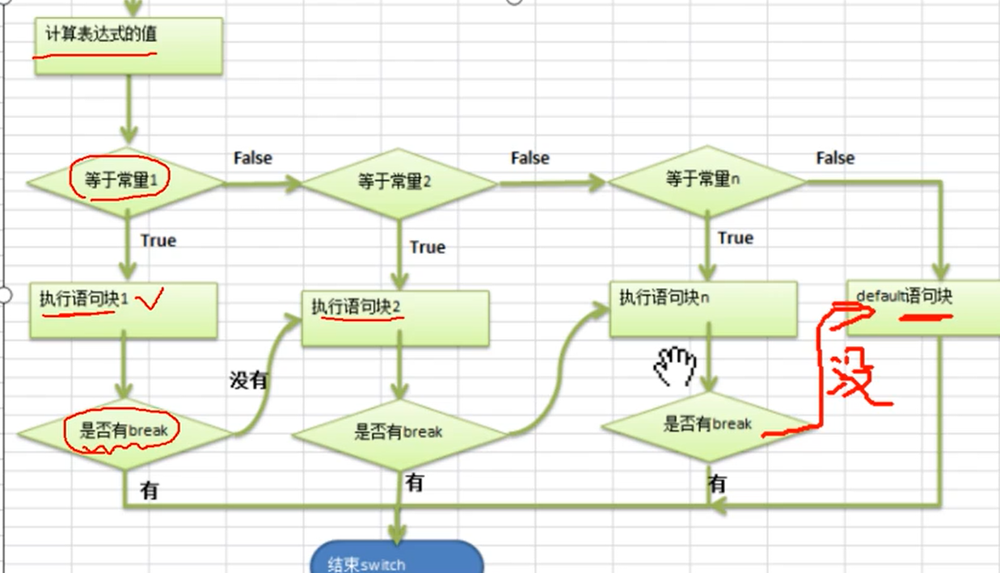

# 控制结构
## 顺序控制
默认，程序从上到下逐行执行，中间没有任何判断和跳转
* 定义变量，合理的向前引用
## 分支控制(if else switch)
* 嵌套分支不要超过三层
### 单分支
````java
if(条件表达式){
    执行代码块;
}
````
### 双分支
````java
if(条件表达式){
    执行代码块1；
}
else{
    执行代码块2;
}
````

### 多分支
````java
if(条件表达式1){
    执行代码块1;
}
else if(条件表达式2){
    执行代码块2;
}
.......
else{
    执行代码块n;
}

````
* 多分支可以没有else,如果所有的条件表达式都不成立，可没有执行入口
````java
switch(对应一个值的表达式){
    case 常量1:
        语句块1;//表达式的值等于常量1时，执行
        break;//退出switch
    case 常量2:
        语句块2;//按序匹配
        break;
    ...
    default:
        语句块;//表达式的值都没有匹配上以上的常量
        break;
}
````
* 如果没有` break`会有穿透效果
* switch表达式的返回值必须是`byte,short,int,char,enum,String`,**double/float不可以**

* *对区间/结果为boolean的判断，推荐使用if判断*

## 循环控制(for while dowhile 多重循环)
### for 循环
````java
for((循环变量初始化);循环条件;(循环变量迭代)){
    循环操作(语句);
}
````
* 循环条件的两端`;`不能省略
* `for(;;)`表示无限循环
* 循环初始值可有多条初始化语句，但要求**类型一样**；也可由多条变量迭代语句`for(int i =0,j=0;i<4;i++,j++){}`
  
**编程思想**
* 化繁为简:将复杂的需求，拆解成简单的需求，逐步完成
* 先死后活:先考虑固定的值，然后转成可以灵活变化的值
### while循环
````java
循环变量初始化;
while(循环条件){
    循环体(语句);
    循环变量迭代;
}
````
### do while循环
````java
循环变量初始化;
do{
    循环体(语句);
    循环变量迭代;
}while(循环条件);
````
### 多重循环
* 推荐不超过3层
## break
循环次数不知道，当某个条件满足时，终止循环
* break 出现在多层嵌套预聚奎钟，通过标签指明要终止的是那一层循环（尽量不使用），默认为终止最近循环体
````java
label1:{
label2:    {
label3:        {
                 break lable2;
                }
            }
        }


````
## continue
结束本次循环，继续执行下一次循环
* 可指定标签，同break用法

## return
一般使用在方法上，表示退出所在方法
